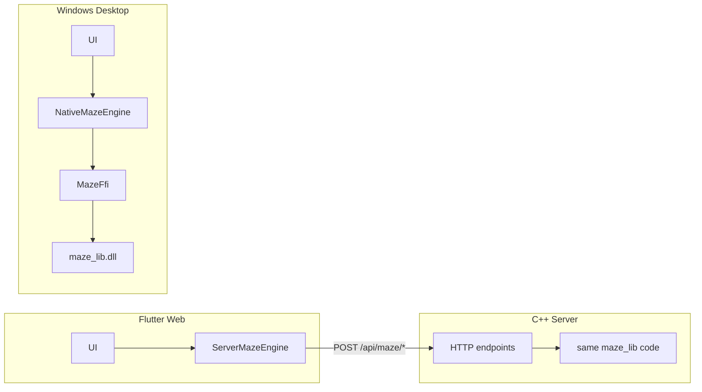

# Web Server Mode (Phase 1)

## 1. Why dart:ffi can't run on web

`dart:ffi` and `dart:io` are not supported in Dart web compilations; the web target runs as JavaScript in the browser and has no native DLL or process APIs. Only JS interop and HTTP (and other web-safe APIs) are available. So to keep maze generation and A* in C++, the web app talks to a local C++ HTTP server that runs the same code.

## 2. How server mode works



- **Desktop**: Flutter uses `NativeMazeEngine` → `MazeFfi` → `maze_lib.dll` (unchanged).
- **Web**: Flutter uses `ServerMazeEngine` → HTTP POST to the C++ server → same C++ `maze_lib` code compiled into `maze_server.exe`. No dart:ffi on web.

## 3. How to run

Copy and run only the command lines below (do not paste any shell prompt like `➜` or `PS ...>`).

**Terminal 1 — C++ server (Windows PowerShell or cmd)**

```bash
cmake -S server_cpp -B server_cpp/build
cmake --build server_cpp/build --config Release
server_cpp\build\Release\maze_server.exe --port 8080
```

**Terminal 2 — Flutter web**

```bash
flutter run -d chrome --dart-define=MAZE_MODE=server --dart-define=MAZE_SERVER_URL=http://localhost:8080
```

If Chrome is not available as a device (e.g. on WSL or some Linux setups), use the web server and open the printed URL in any browser:

```bash
flutter run -d web-server --dart-define=MAZE_MODE=server --dart-define=MAZE_SERVER_URL=http://localhost:8080
```

Start the C++ server first so the web app can reach it.

## 4. Common failures

| Failure | Cause | Fix |
|--------|--------|-----|
| **CORS errors** (browser console) | Server not sending CORS headers or not handling OPTIONS | Ensure `maze_server` is built from this repo (sends `Access-Control-Allow-Origin: *` and handles OPTIONS for both routes). |
| **Connection refused / failed to load** | Server not running or wrong port | Start `maze_server.exe --port 8080` before running Flutter web. If using another port, set `MAZE_SERVER_URL` to match (e.g. `http://localhost:9090`). |
| **Invalid JSON** | Malformed request or response | Check Content-Type is `application/json` and body is valid JSON. For 400 responses, server returns `{"error": "message"}`. |
| **On web, UnsupportedError** | Web run without server mode | Always use `--dart-define=MAZE_MODE=server` for Flutter web. |
| **No supported devices found... 'chrome'** | Chrome not a Flutter device (e.g. WSL/Linux) | Use `-d web-server` instead of `-d chrome`; open the printed URL in a browser. |
| **'➜' is not recognized** (PowerShell) | Pasted a shell prompt (e.g. `➜  2dmaze git:(main)`) into the terminal | Run only the command line; do not copy the prompt. On Windows use backslash in the exe path: `server_cpp\build\Release\maze_server.exe`. |
